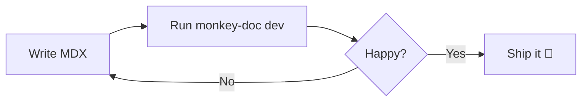
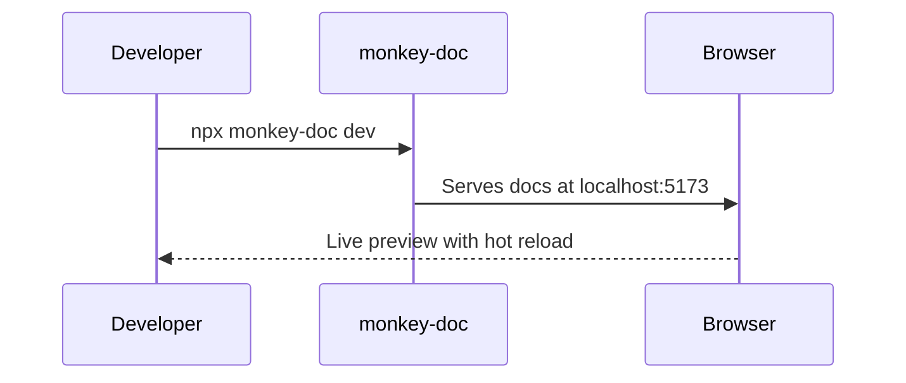
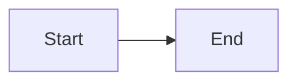

# Components

Monkey-Doc ships with a set of built-in MDX components you can use anywhere.

## Callout

Highlight important information.

<Callout type="info">This is an **info** callout.</Callout>

<Callout type="warning">This is a **warning** callout.</Callout>

<Callout type="success">This is a **success** callout.</Callout>

```mdx
<Callout type="info">Your message here.</Callout>
```

## Steps

Walk users through a sequence.

<Steps>
  <Step title="First step">Do this first.</Step>
  <Step title="Second step">Then do this.</Step>
  <Step title="Third step">Finally, do this.</Step>
</Steps>

```mdx
<Steps>
  <Step title="First step">Do this first.</Step>
  <Step title="Second step">Then do this.</Step>
</Steps>
```

## Card

Group related content visually.

<Card title="Quick tip" description="Cards are great for feature highlights or link grids." />

```mdx
<Card title="Quick tip" description="Your description here." />
```

## Tabs

Display content in tabbed panels.

<Tabs labels={["npm", "yarn", "pnpm"]}>
  <div><code>npm install monkey-doc</code></div>
  <div><code>yarn add monkey-doc</code></div>
  <div><code>pnpm add monkey-doc</code></div>
</Tabs>

## FileTree

Visualize a folder structure.

<FileTree>
  <Folder name="docs">
    <File name="getting-started.mdx" highlight />
    <Folder name="guides">
      <File name="writing-guides.mdx" />
      <File name="best-practices.mdx" />
    </Folder>
    <File name="components.mdx" />
  </Folder>
</FileTree>

Use the `highlight` prop on a `<File>` to draw attention to a specific file.

```mdx
<FileTree>
  <Folder name="docs">
    <File name="getting-started.mdx" highlight />
    <Folder name="guides">
      <File name="writing-guides.mdx" />
    </Folder>
  </Folder>
</FileTree>
```

## CodeGroup

Show multiple code snippets in tabs — ideal for package manager commands or multi-language examples.

<CodeGroup labels={["npm", "yarn", "pnpm"]}>

```bash
npm install monkey-doc
```

```bash
yarn add monkey-doc
```

```bash
pnpm add monkey-doc
```

</CodeGroup>

```mdx
<CodeGroup labels={["npm", "yarn", "pnpm"]}>

​```bash
npm install monkey-doc
​```

​```bash
yarn add monkey-doc
​```

</CodeGroup>
```

## Accordion

Collapsible sections, great for FAQs or optional details.

<Accordion title="What is Monkey-Doc?">
  Monkey-Doc is a documentation tool focused on product guides and storytelling, as an alternative to Storybook.
</Accordion>

<Accordion title="Do I need to configure anything?">
  No — run `npx monkey-doc init` and you're ready to go. Zero configuration required.
</Accordion>

<Accordion title="Can I nest folders?" defaultOpen>
  Yes, folders can be nested as deeply as needed. The sidebar is generated automatically from your file structure.
</Accordion>

```mdx
<Accordion title="Your question here">
  Your answer here.
</Accordion>

<Accordion title="Open by default" defaultOpen>
  This one starts expanded.
</Accordion>
```

## Badge

Inline labels for status, versioning, or categorization.

<div className="flex flex-wrap gap-2 my-4">
  <Badge>Default</Badge>
  <Badge variant="info">Info</Badge>
  <Badge variant="success">Success</Badge>
  <Badge variant="warning">Warning</Badge>
  <Badge variant="error">Error</Badge>
  <Badge variant="new">New</Badge>
  <Badge variant="beta">Beta</Badge>
  <Badge variant="deprecated">Deprecated</Badge>
</div>

Use badges inline in prose too — for example, this feature is <Badge variant="new">New</Badge> in v2.

```mdx
<Badge variant="new">New</Badge>
<Badge variant="beta">Beta</Badge>
<Badge variant="deprecated">Deprecated</Badge>
```

Available variants: `default` · `info` · `success` · `warning` · `error` · `new` · `beta` · `deprecated`

## Mermaid

Render diagrams from [Mermaid](https://mermaid.js.org) syntax. Use a fenced code block with the `mermaid` language, or the `<Mermaid>` component directly.





~~~mdx

~~~

## Property

Document a prop, parameter, or configuration option with its type, default value, and description.

<PropertyGroup title="Props">
  <Property name="title" type="string" required>
    The title of the page or section.
  </Property>
  <Property name="order" type="number" defaultValue="999">
    Controls the position of the page in the sidebar. Lower values appear first.
  </Property>
  <Property name="description" type="string">
    A short description shown in search results and meta tags.
  </Property>
  <Property name="theme" type='"light" | "dark" | "auto"' defaultValue='"auto"'>
    Sets the color theme for the documentation site.
  </Property>
  <Property name="legacyProp" type="boolean" deprecated>
    This prop is no longer used. Remove it from your config.
  </Property>
</PropertyGroup>

```mdx
<PropertyGroup title="Props">
  <Property name="title" type="string" required>
    The title of the page.
  </Property>
  <Property name="order" type="number" defaultValue="999">
    Position in the sidebar.
  </Property>
  <Property name="theme" type='"light" | "dark"' defaultValue='"auto"'>
    Color theme.
  </Property>
  <Property name="old" type="boolean" deprecated>
    No longer used.
  </Property>
</PropertyGroup>
```

`<PropertyGroup>` is optional — use it to group related properties under a label. `<Property>` can also be used standalone.

## Video

Embed a video from a URL or a YouTube / Vimeo link. YouTube and Vimeo links show a poster with a play button and only load the embed on click.

<Video
  src="https://www.youtube.com/watch?v=dQw4w9WgXcQ"
  poster="https://img.youtube.com/vi/dQw4w9WgXcQ/maxresdefault.jpg"
  title="Demo video"
  caption="A short demo of the feature in action."
/>

```mdx
{/* Local or hosted file */}
<Video src="/demo.mp4" caption="Feature walkthrough" />

{/* YouTube — lazy-loads embed on click */}
<Video
  src="https://www.youtube.com/watch?v=VIDEO_ID"
  poster="https://img.youtube.com/vi/VIDEO_ID/maxresdefault.jpg"
  title="Demo"
  caption="Optional caption"
/>

{/* Auto-playing muted loop (great for UI demos) */}
<Video src="/preview.mp4" autoplay loop />
```

## Breadcrumb

An inline breadcrumb trail for content pages — useful at the top of a page to show where the reader is in the documentation.

<Breadcrumb items={["Docs", "Components", "Breadcrumb"]} />

Items can include optional `href` links:

<Breadcrumb items={[{ label: "Docs", href: "/" }, { label: "Components", href: "/components" }, "Breadcrumb"]} />

```mdx
<Breadcrumb items={["Docs", "Components", "Breadcrumb"]} />

<Breadcrumb items={[{ label: "Docs", href: "/" }, "Components"]} />
```

## Diff

Show a before/after code diff with green/red line highlighting. Uses a real LCS algorithm to highlight only the lines that actually changed.

<Diff
  before={`function greet(name) {
  return "Hello " + name;
}`}
  after={`function greet(name) {
  return \`Hello, \${name}!\`;
}`}
  language="js"
/>

```mdx
<Diff
  before={`const message = "Hello World"`}
  after={`const message = "Hello, Universe!"`}
  language="js"
/>
```

The `language` prop is optional — it adds a label to the top of the block.

## Stepper

An interactive checklist-style stepper. Click a step to mark it complete. Checking a step also checks all previous steps; unchecking it clears all following steps.

<Stepper>
  <StepperStep title="Clone the repository">
    Run `git clone https://github.com/your-org/your-project.git` to get a local copy.
  </StepperStep>
  <StepperStep title="Install dependencies">
    Navigate into the project folder and run `npm install`.
  </StepperStep>
  <StepperStep title="Start the dev server">
    Run `npm run dev` and open `http://localhost:5173` in your browser.
  </StepperStep>
</Stepper>

```mdx
<Stepper>
  <StepperStep title="Clone the repository">
    Run `git clone ...`
  </StepperStep>
  <StepperStep title="Install dependencies">
    Run `npm install`.
  </StepperStep>
</Stepper>
```
