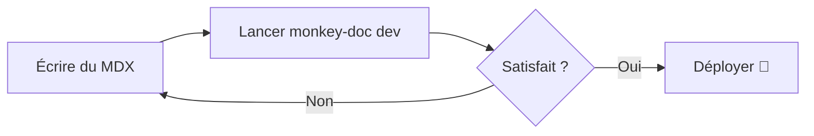
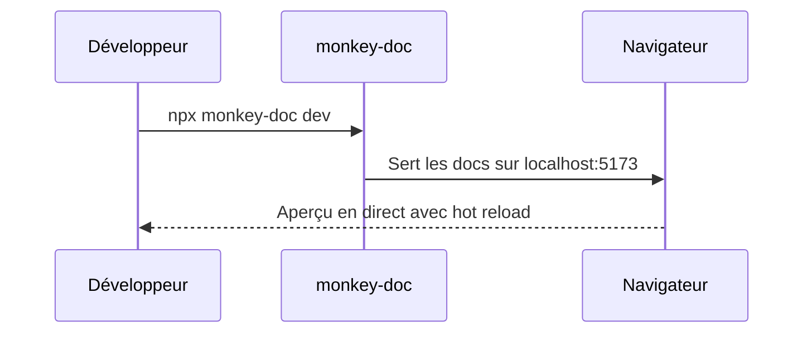
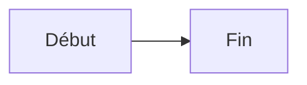

# Composants

Monkey-Doc est livré avec un ensemble de composants MDX intégrés utilisables partout.

## Callout

Mettez en évidence des informations importantes.

<Callout type="info">Ceci est un callout **info**.</Callout>

<Callout type="warning">Ceci est un callout **avertissement**.</Callout>

<Callout type="success">Ceci est un callout **succès**.</Callout>

```mdx
<Callout type="info">Votre message ici.</Callout>
```

## Steps

Guidez les utilisateurs à travers une séquence.

<Steps>
  <Step title="Première étape">Faites ceci en premier.</Step>
  <Step title="Deuxième étape">Puis faites cela.</Step>
  <Step title="Troisième étape">Enfin, faites ceci.</Step>
</Steps>

```mdx
<Steps>
  <Step title="Première étape">Faites ceci en premier.</Step>
  <Step title="Deuxième étape">Puis faites cela.</Step>
</Steps>
```

## Card

Regroupez visuellement du contenu lié.

<Card title="Conseil rapide" description="Les cartes sont idéales pour mettre en avant des fonctionnalités ou créer des grilles de liens." />

```mdx
<Card title="Conseil rapide" description="Votre description ici." />
```

## Tabs

Affichez du contenu dans des panneaux à onglets.

<Tabs labels={["npm", "yarn", "pnpm"]}>
  <div><code>npm install monkey-doc</code></div>
  <div><code>yarn add monkey-doc</code></div>
  <div><code>pnpm add monkey-doc</code></div>
</Tabs>

## FileTree

Visualisez une structure de dossiers.

<FileTree>
  <Folder name="docs">
    <File name="getting-started.mdx" highlight />
    <Folder name="guides">
      <File name="writing-guides.mdx" />
      <File name="best-practices.mdx" />
    </Folder>
    <File name="components.mdx" />
  </Folder>
</FileTree>

Utilisez la prop `highlight` sur un `<File>` pour attirer l'attention sur un fichier spécifique.

```mdx
<FileTree>
  <Folder name="docs">
    <File name="getting-started.mdx" highlight />
    <Folder name="guides">
      <File name="writing-guides.mdx" />
    </Folder>
  </Folder>
</FileTree>
```

## CodeGroup

Affichez plusieurs extraits de code dans des onglets — idéal pour les commandes de gestionnaires de paquets ou les exemples multi-langages.

<CodeGroup labels={["npm", "yarn", "pnpm"]}>

```bash
npm install monkey-doc
```

```bash
yarn add monkey-doc
```

```bash
pnpm add monkey-doc
```

</CodeGroup>

```mdx
<CodeGroup labels={["npm", "yarn", "pnpm"]}>

​```bash
npm install monkey-doc
​```

​```bash
yarn add monkey-doc
​```

</CodeGroup>
```

## Accordion

Sections repliables, idéales pour les FAQ ou les détails optionnels.

<Accordion title="Qu'est-ce que Monkey-Doc ?">
  Monkey-Doc est un outil de documentation orienté guides produit et storytelling, en alternative à Storybook.
</Accordion>

<Accordion title="Faut-il configurer quelque chose ?">
  Non — lancez `npx monkey-doc init` et c'est prêt. Zéro configuration requise.
</Accordion>

<Accordion title="Peut-on imbriquer des dossiers ?" defaultOpen>
  Oui, les dossiers peuvent être imbriqués aussi profondément que nécessaire. La sidebar est générée automatiquement depuis la structure de fichiers.
</Accordion>

```mdx
<Accordion title="Votre question ici">
  Votre réponse ici.
</Accordion>

<Accordion title="Ouvert par défaut" defaultOpen>
  Celui-ci commence déplié.
</Accordion>
```

## Badge

Étiquettes inline pour le statut, le versioning ou la catégorisation.

<div className="flex flex-wrap gap-2 my-4">
  <Badge>Default</Badge>
  <Badge variant="info">Info</Badge>
  <Badge variant="success">Succès</Badge>
  <Badge variant="warning">Attention</Badge>
  <Badge variant="error">Erreur</Badge>
  <Badge variant="new">Nouveau</Badge>
  <Badge variant="beta">Beta</Badge>
  <Badge variant="deprecated">Déprécié</Badge>
</div>

Les badges s'utilisent aussi en ligne dans le texte — par exemple, cette fonctionnalité est <Badge variant="new">Nouvelle</Badge> en v2.

```mdx
<Badge variant="new">Nouveau</Badge>
<Badge variant="beta">Beta</Badge>
<Badge variant="deprecated">Déprécié</Badge>
```

Variantes disponibles : `default` · `info` · `success` · `warning` · `error` · `new` · `beta` · `deprecated`

## Mermaid

Rendu de diagrammes depuis la syntaxe [Mermaid](https://mermaid.js.org). Utilisez un bloc de code avec le langage `mermaid`, ou le composant `<Mermaid>` directement.





~~~mdx

~~~

## Property

Documentez une prop, un paramètre ou une option de configuration avec son type, sa valeur par défaut et sa description.

<PropertyGroup title="Props">
  <Property name="title" type="string" required>
    Le titre de la page ou de la section.
  </Property>
  <Property name="order" type="number" defaultValue="999">
    Contrôle la position de la page dans la sidebar. Les valeurs basses apparaissent en premier.
  </Property>
  <Property name="description" type="string">
    Une courte description affichée dans les résultats de recherche et les balises meta.
  </Property>
  <Property name="theme" type='"light" | "dark" | "auto"' defaultValue='"auto"'>
    Définit le thème de couleur du site de documentation.
  </Property>
  <Property name="ancienneProp" type="boolean" deprecated>
    Cette prop n'est plus utilisée. Retirez-la de votre config.
  </Property>
</PropertyGroup>

```mdx
<PropertyGroup title="Props">
  <Property name="title" type="string" required>
    Le titre de la page.
  </Property>
  <Property name="order" type="number" defaultValue="999">
    Position dans la sidebar.
  </Property>
  <Property name="theme" type='"light" | "dark"' defaultValue='"auto"'>
    Thème de couleur.
  </Property>
  <Property name="ancienne" type="boolean" deprecated>
    Plus utilisée.
  </Property>
</PropertyGroup>
```

`<PropertyGroup>` est optionnel — utilisez-le pour regrouper des propriétés liées sous un label. `<Property>` peut aussi être utilisé seul.

## Video

Intégrez une vidéo depuis une URL ou un lien YouTube / Vimeo. Les liens YouTube et Vimeo affichent un poster avec un bouton play et ne chargent l'embed qu'au clic.

<Video
  src="https://www.youtube.com/watch?v=dQw4w9WgXcQ"
  poster="https://img.youtube.com/vi/dQw4w9WgXcQ/maxresdefault.jpg"
  title="Vidéo de démo"
  caption="Une courte démo de la fonctionnalité en action."
/>

```mdx
{/* Fichier local ou hébergé */}
<Video src="/demo.mp4" caption="Présentation de la fonctionnalité" />

{/* YouTube — charge l'embed au clic */}
<Video
  src="https://www.youtube.com/watch?v=VIDEO_ID"
  poster="https://img.youtube.com/vi/VIDEO_ID/maxresdefault.jpg"
  title="Démo"
  caption="Légende optionnelle"
/>

{/* Lecture automatique muette en boucle (idéal pour les démos UI) */}
<Video src="/apercu.mp4" autoplay loop />
```

## Breadcrumb

Un fil d'Ariane embarqué dans le contenu — utile en haut d'une page pour situer le lecteur dans la documentation.

<Breadcrumb items={["Docs", "Composants", "Breadcrumb"]} />

Les éléments peuvent inclure des liens `href` optionnels :

<Breadcrumb items={[{ label: "Docs", href: "/" }, { label: "Composants", href: "/components" }, "Breadcrumb"]} />

```mdx
<Breadcrumb items={["Docs", "Composants", "Breadcrumb"]} />

<Breadcrumb items={[{ label: "Docs", href: "/" }, "Composants"]} />
```

## Diff

Affiche un diff avant/après avec highlighting vert/rouge. Utilise un vrai algorithme LCS pour ne mettre en évidence que les lignes réellement modifiées.

<Diff
  before={`function greet(name) {
  return "Bonjour " + name;
}`}
  after={`function greet(name) {
  return \`Bonjour, \${name} !\`;
}`}
  language="js"
/>

```mdx
<Diff
  before={`const message = "Bonjour monde"`}
  after={`const message = "Bonjour l'univers !"`}
  language="js"
/>
```

La prop `language` est optionnelle — elle ajoute un label en haut du bloc.

## Stepper

Un stepper interactif de type checklist. Cliquez sur une étape pour la marquer comme complétée. Cocher une étape coche aussi toutes les précédentes ; la décocher efface toutes les suivantes.

<Stepper>
  <StepperStep title="Cloner le dépôt">
    Lancez `git clone https://github.com/votre-org/votre-projet.git` pour obtenir une copie locale.
  </StepperStep>
  <StepperStep title="Installer les dépendances">
    Naviguez dans le dossier du projet et lancez `npm install`.
  </StepperStep>
  <StepperStep title="Démarrer le serveur de développement">
    Lancez `npm run dev` et ouvrez `http://localhost:5173` dans votre navigateur.
  </StepperStep>
</Stepper>

```mdx
<Stepper>
  <StepperStep title="Cloner le dépôt">
    Lancez `git clone ...`
  </StepperStep>
  <StepperStep title="Installer les dépendances">
    Lancez `npm install`.
  </StepperStep>
</Stepper>
```
